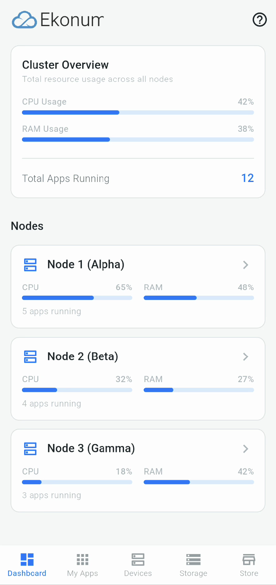
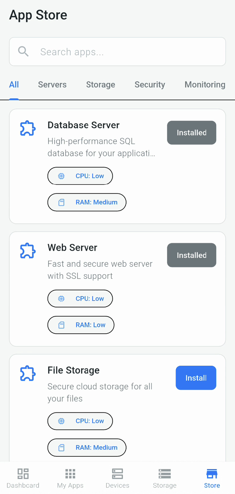
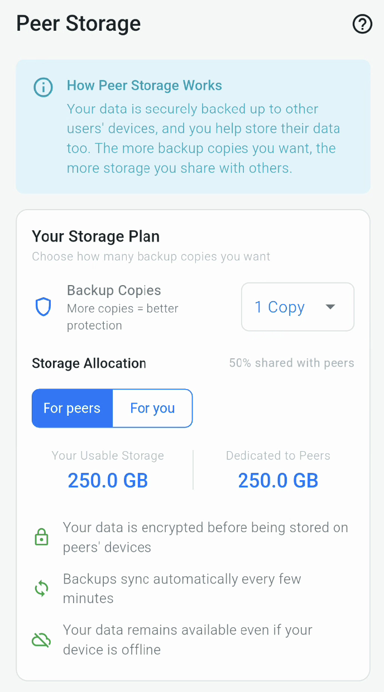
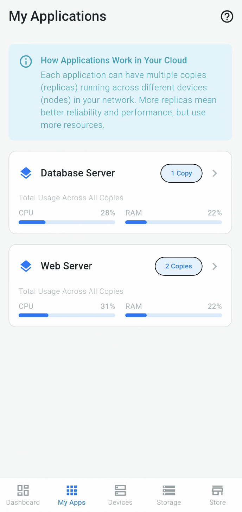
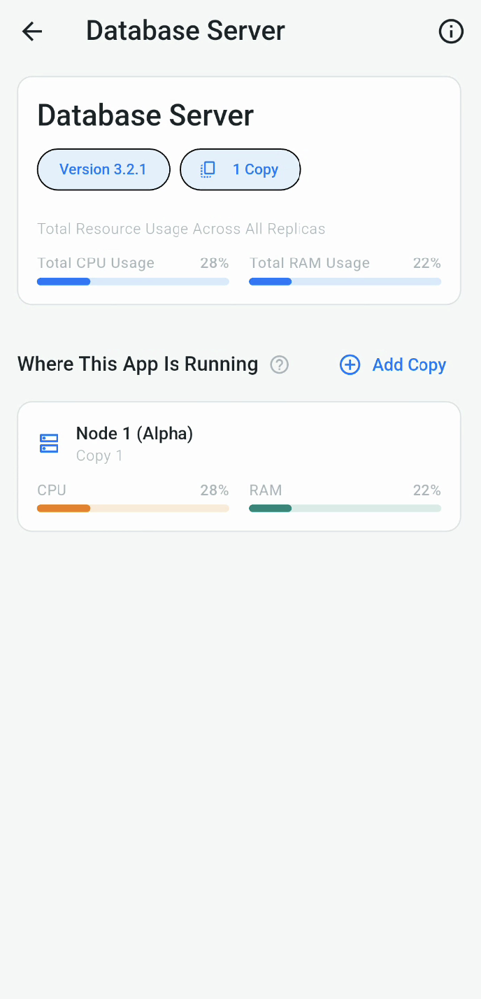
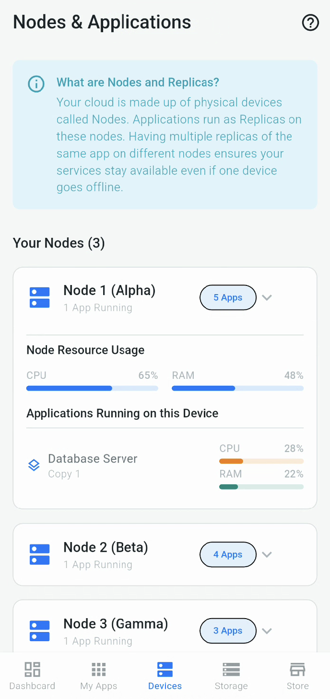

# Ekonum Flutter App - Private Cloud Management


This repository contains the Flutter mobile application for managing the **Ekonum** private cloud
platform. It provides a user-friendly interface for users to monitor their cluster resources, manage
deployed applications, interact with the application store, and configure peer-to-peer storage
replication settings.

The app is designed with a focus on simplicity and visual clarity, leveraging the Material 3 design
system to create a modern and intuitive experience, even for users less familiar with cloud
concepts.

## Features

* **Dashboard:** At-a-glance overview of the entire cluster's CPU and RAM usage, total running
  applications, and a list of active nodes with their individual resource consumption.
* **Node Details:** Drill-down view for each node, showing detailed resource usage and a list of
  application replicas currently running on that specific device.
* **Application Store:** Browse, search, and filter containerized applications available for
  deployment. Install and uninstall applications with ease. View resource requirements (CPU/RAM).
* **My Applications:** View all currently installed applications, see their overall resource usage
  across all replicas, and check how many copies are running.
* **Application Details:** Manage individual applications, view detailed replica information (which
  replica runs on which node and its resource usage), and scale applications by adding/removing
  replicas.
* **Device/Node View:** A dedicated screen showing each node (device) and easily expanding to see
  which specific application replicas are running on it.
* **Peer Storage Management:**
    * Configure the desired number of data backup copies for peer-to-peer replication.
    * Visualize storage allocation (Usable vs. Dedicated to Peers).
    * View current backup status, last sync time, and initiate manual syncs.
    * Choose backup peers either specifically or using the "Smart Selection" mode (placeholder UI
      for smart).
* **Modern UI:** Clean, responsive interface built with Flutter and Material 3 components.
* **State Management:** Uses the `provider` package for efficient and maintainable state management.

## Screenshots

**Dashboard**


**App Store**


**Storage Configuration**


**My Apps**


**App Details (Replicas)**


**Node/Device Details**


## Tech Stack

* **Flutter SDK:** (>=3.0.0 <4.0.0)
* **Dart:** (3.7.2)
* **State Management:** `provider`
* **UI:** Material 3
* **Formatting:** `intl`
* **Mock Data:** Currently uses mock data within Providers for UI development.

## Getting Started

### Prerequisites

* Flutter SDK installed (
  See [Flutter installation guide](https://docs.flutter.dev/get-started/install))
* A code editor like VS Code or Android Studio.
* An emulator/simulator or a physical device to run the app.

### Installation & Running

1. **Clone the repository:**
   ```bash
   git clone https://github.com/Ekonum/GUI.git
   cd ekonum_app
   ```
2. **Ensure Assets:** Make sure the Ekonum logo exists at `assets/logos/ekonum_logo.svg` (or update
   the path in `pubspec.yaml` and `lib/features/common/widgets/ekonum_logo.dart` if different).
3. **Install dependencies:**
   ```bash
   flutter pub get
   ```
4. **Run the app:**
   ```bash
   flutter run
   ```

## Project Structure

The project follows a feature-first structure:

```
lib/
├── app.dart # Root MaterialApp widget setup
├── main.dart # App entry point & Provider setup
├── config/ # Theme, Colors, Constants
├── core/ # Core logic, Models, Providers, Services (API calls eventually)
│ ├── models/ # Data models (Node, Application, Peer, etc.)
│ └── providers/ # State management (ChangeNotifiers)
├── features/ # UI Screens and Widgets per feature
│ ├── auth/ # Login/Signup (Placeholder)
│ ├── common/ # Widgets shared across features
│ ├── dashboard/ # Dashboard screen, Node details, widgets
│ ├── devices/ # Combined Node & App list screen, widgets
│ ├── main_navigator.dart # Bottom Navigation Bar host
│ ├── my_apps/ # Installed apps screen, App details, widgets
│ ├── storage/ # Storage config screen, widgets (Plan, Status, Peers)
│ └── store/ # App store screen, widgets
├── navigation/ # Routing logic (currently implicit/simple)
└── utils/ # Utility functions (e.g., Formatters)
```

## State Management

This project uses the `provider` package for state management.

* `ChangeNotifierProvider` is used to provide instances of state classes (e.g., `DashboardProvider`,
  `StorageProvider`).
* `context.watch<T>()` is used in `build` methods to listen for changes and rebuild the UI.
* `context.read<T>()` is used inside callbacks (like `onPressed`, `onChanged`, `initState`) to
  access the provider without listening for changes.
* Mock data is currently initialized and managed within the respective provider classes.

## Future Improvements / TODO

* **API Integration:** Replace all mock data in Providers with actual API calls to the Ekonum
  backend.
* **Authentication:** Implement the full login/signup flow and manage authentication state.
* **Error Handling:** Add robust error handling for API calls and display user-friendly messages.
* **Testing:** Implement Unit, Widget, and Integration tests.
* **Onboarding/Tooltips:** Add more detailed tooltips or a guided onboarding experience.
* **Dark Theme:** Implement a full dark theme variant.
* **Responsiveness:** Further test and refine layouts for tablet and potentially web deployment.
* **Localization (i18n):** Add support for multiple languages.
* **CI/CD:** Set up Continuous Integration and Deployment pipelines.
* **Refine UI/UX:** Continuously gather feedback and improve the user experience.

## Contributing

Contributions are welcome! Please feel free to open an issue to discuss a bug or feature request, or
submit a pull request.